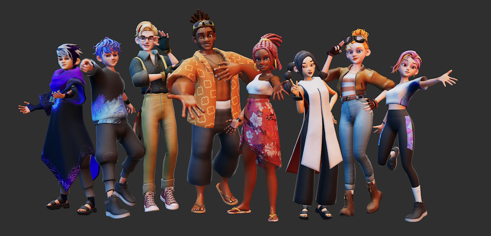

# VIVERSE PlayCanvas VRM


A PlayCanvas library for loading and manipulating VRM models (VRM 0.0 and VRM 1.0).

This library is based on and references the implementation from [three-vrm](https://github.com/pixiv/three-vrm) by pixiv, adapted for use with the PlayCanvas engine.




## Features

- VRM 0.0 and VRM 1.0 support
- VRM Animation (VRMA) loading and playback
- VRM Expression system
- VRM Spring Bone physics
- Humanoid rig support
- TypeScript type definitions included

## Development Setup

### Prerequisites

- Node.js and pnpm installed
- PlayCanvas ^2.10.3 as peer dependency

### ESLint + Prettier Configuration

- Install VSCode extensions:
  1. [Prettier ESLint](https://marketplace.visualstudio.com/items?itemName=rvest.vs-code-prettier-eslint)
  2. [Prettier](https://marketplace.visualstudio.com/items?itemName=esbenp.prettier-vscode)
- Press `F1` and select `>Format Document...` to choose formatter
- Select `Prettier` as default formatter
- Enable `Editor: Format On Save`

### Development Workflow

Build and watch for changes (outputs to `dist/`):

```bash
pnpm watch
```

Run the example project:

```bash
cd examples/project
pnpm dev
```

### Build

```bash
pnpm build
```

This generates both unminified and minified versions in `dist/`.

## Installation & Usage

### Method A: ES Module Import (Recommended for npm packages)

```typescript
import {
  VrmAnimation,
  VrmExpression,
  VrmSpringBone,
  createFormattedVRMHumanoid,
  addIndexToNodeTags,
  getVersion,
  RenderStates,
} from '@viverse/playcanvas-vrm';
```

### Method B: Script Tag (CDN)

Load the script and access via `window.VRMLoader`:

```javascript
const loadScript = () =>
  new Promise((resolve, reject) => {
    const script = document.createElement('script');
    script.type = 'module';
    script.src = 'https://your-cdn.com/playcanvas-vrm.js';
    script.async = false;
    document.head.appendChild(script);
    
    script.onload = () => {
      const VRMLoader = window.VRMLoader;
      resolve(VRMLoader);
    };
    
    script.onerror = (error) => reject(error);
  });

// Usage
await loadScript();
const VRMLoader = window.VRMLoader;
```

## Basic Usage Example

```typescript
import * as pc from 'playcanvas';

// Load VRM model
const asset = new pc.Asset('avatar', 'container', { url: 'path/to/model.vrm' });
app.assets.add(asset);

asset.on('load', (asset) => {
  // Add index tags to nodes for easier referencing
  VRMLoader.addIndexToNodeTags(asset);
  
  // Create entities
  const renderEntity = asset.resource.instantiateRenderEntity();
  const rootEntity = new pc.Entity('VRM_AVATAR_ROOT');
  rootEntity.addChild(renderEntity);
  
  // Check VRM version
  const version = VRMLoader.getVersion(asset);
  
  // Rotate v0 models to face +z axis
  if (version === 'v0') {
    rootEntity.rotateLocal(0, 180, 0);
  }
  
  // Create humanoid rig
  const humanoid = VRMLoader.createFormattedVRMHumanoid(pc, asset, rootEntity, {
    autoUpdateHumanBones: version === 'v1',
  });
  
  // Add animation component
  const animatedEntity = version === 'v1' 
    ? humanoid.normalizedHumanBonesRoot 
    : rootEntity;
    
  animatedEntity.addComponent('anim', {
    activate: true,
  });
  
  // Add VRM scripts
  rootEntity.addComponent('script');
  
  rootEntity.script.create('vrmExpression', {
    attributes: { asset },
  });
  
  rootEntity.script.create('vrmSpringBone', {
    attributes: { asset },
  });
  
  // Update humanoid in game loop
  app.on('update', (dt) => {
    if (humanoid) humanoid.update();
  });
  
  app.root.addChild(rootEntity);
});

asset.load();
```

## API Reference

### Main Exports

- **VrmAnimation**: Animation utilities and loaders
- **VrmExpression**: Expression/morph target management
- **VrmSpringBone**: Spring bone physics system
- **VrmMapList**: VRM mapping utilities
- **createFormattedVRMHumanoid(pc, asset, entity, options)**: Create humanoid rig
- **addIndexToNodeTags(asset)**: Add indices to node tags for reference
- **getVersion(asset)**: Get VRM version ('v0' or 'v1')
- **RenderStates**: Render state helpers

### Classes

- **VRMHumanoid**: Humanoid rig controller
- **VRMExpressionManager**: Expression system manager
- **VRMSpringBoneManager**: Spring bone physics manager

## Examples

See the `examples/` directory for complete examples:

- `add-vrm-animations.ts` - Loading and playing VRMA animations
- `vrm-expression.ts` - Working with facial expressions
- `vrm-spring-bone.ts` - Spring bone physics setup
- `project/` - Full working example project

## Known Issues

### VRM Animation (VRMA) - Missing Hip Translation

**Issue**: VRMA files without translation data may cause the hips to move to origin.

**Solution**: This has been addressed in the codebase. If you encounter this issue, the library automatically creates an empty translation track for the hips joint.

## Publishing

This package is published to the internal VIVERSE npm registry:

```bash
# Patch release (1.6.0 -> 1.6.1)
pnpm release:patch

# Minor release (1.6.0 -> 1.7.0)
pnpm release:minor

# Major release (1.6.0 -> 2.0.0)
pnpm release:major
```

## Credits

This library is heavily based on the excellent [three-vrm](https://github.com/pixiv/three-vrm) library by pixiv Inc. Many core implementations, especially for VRM specification parsing, spring bone physics, and expression systems, are adapted from three-vrm for the PlayCanvas engine.

**three-vrm**: https://github.com/pixiv/three-vrm  
**License**: MIT License  
**Copyright**: pixiv Inc.

We are grateful to the three-vrm team and contributors for their work on VRM support in the JavaScript ecosystem.

## License

UNLICENSED - Internal VIVERSE use only
